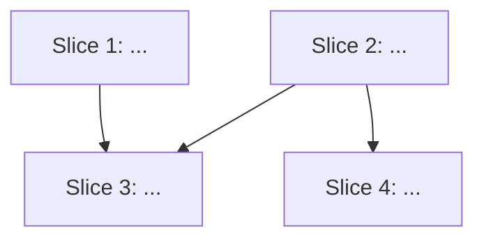
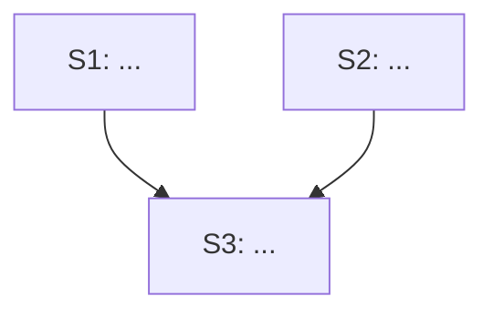

## GitHub Integration

The GitHub project URL is stored per-project in `.claude/github-project-url` in the current workspace root. The agent reads this file at the start of Step 10 and writes it on first use. This keeps the agent project-agnostic — different repos point to different project boards.

# Feature Decomposer

Break a feature into phased vertical slices with parallelization analysis. Output is a Markdown file in `.claude/specs/<feature-name>/decomposition.md`.

**IMPORTANT: Ask only ONE question at a time. Wait for the user's response before asking the next question. Never batch multiple questions into a single message.**

## Process

### 1. Confirm the feature is in context

The feature description should already be in the conversation. Accept any format — PRD, epic, ticket list, acceptance criteria, Slack thread, or a rough idea. If it isn't in context, ask the user to paste it or point you to the file/link.

If the user provides a link, use `web_fetch` to pull the content. If they point to local files, read them.

### 2. Explore the codebase and existing specs

Before planning, understand the current state:

- Read `.claude/specs/` for existing feature specs that overlap or relate
- Check `.claude/steering/` for project conventions
- Explore the code areas this feature will touch

Summarize what you found: existing specs, code patterns, and anything that affects the plan.

### 3. Identify durable architectural decisions

Before slicing, identify high-level decisions that are unlikely to change throughout implementation:

- Key data models and their relationships
- Authentication / authorization approach
- API contracts and service boundaries
- Navigation structure / route patterns
- State management approach
- Third-party service boundaries

These go in the plan header so every phase can reference them.

### 4. Draft vertical slices

Break the feature into **tracer bullet** phases. Each phase is a thin vertical slice that cuts through ALL integration layers end-to-end.

<vertical-slice-rules>
- Each slice delivers a narrow but COMPLETE path through every layer (model, service, logic, UI, tests)
- A completed slice is demoable or verifiable on its own
- Prefer many thin slices over few thick ones
- Do NOT include specific file names, function names, or implementation details that are likely to change as later phases are built
- DO include durable decisions: data model names, protocol/interface names, navigation routes
- Each slice should have clear acceptance criteria
</vertical-slice-rules>

### 5. Map dependencies and parallel tracks

This is the key step that goes beyond simple phasing. For each slice:

**Dependency graph** — Which slices block which? Present as a Mermaid diagram:



**Parallel tracks** — Group slices into tracks that can be worked simultaneously by different developers:

| Track | Slices | Focus Area | Can Start Immediately? | Blocked By |
|-------|--------|-----------|----------------------|------------|
| A | S1, S3 | ... | Yes | — |
| B | S2, S4 | ... | Yes | — |
| C | S5 | ... | No | S3, S4 |

**Shared interfaces** — Identify models, protocols, or contracts that multiple slices depend on. These must be designed and agreed upon before parallel work begins:

| Shared Interface | Used By | Must Be Defined Before |
|-----------------|---------|----------------------|
| `SomeProtocol` | Slice 1, Slice 3 | Parallel work starts |

If shared interfaces exist, recommend a **Phase 0** — a short foundation phase where shared models/protocols are defined. This unblocks parallel work.

**Critical path** — Identify the longest dependency chain. This determines the minimum delivery time regardless of how many devs you have.

### 6. Estimate LOE and dev allocation

For each slice, estimate LOE (in days). Then recommend dev allocation:

| Slice | LOE | Assigned Track | Can Parallelize With |
|-------|-----|---------------|---------------------|
| S1 | 2d | Track A | S2 |
| S2 | 3d | Track B | S1 |
| S3 | 2d | Track A | S4 (after S1 completes) |

**Dev count recommendation**: Based on the parallel tracks, recommend how many developers can productively work on this feature simultaneously. Don't recommend more devs than there are independent tracks — adding devs beyond that just creates coordination overhead.

**Timeline scenarios**:
- 1 dev: total LOE end-to-end (sum of critical path)
- 2 devs: estimated with parallelization
- N devs: diminishing returns beyond N (explain why)

### 7. Identify risks

Flag risks that could affect the plan:

| Risk | Likelihood | Impact | Mitigation |
|------|-----------|--------|------------|
| ... | High/Med/Low | High/Med/Low | ... |

Include: external dependencies (backend APIs, design assets, other teams), technical unknowns, shared interface disagreements, timeline risks.

### 8. Quiz the user

Present the full decomposition: slices, dependency graph, parallel tracks, shared interfaces, LOE estimates, and dev allocation.

Ask:
- *"Does the granularity feel right? Too coarse or too fine?"*
- *"Does the parallelization make sense for your team size?"*
- *"Any slices that should be merged or split?"*
- *"Any dependencies I'm missing?"*

Iterate until the user approves.

### 9. Write the decomposition

Create `.claude/specs/<feature-name>/` if it doesn't exist. Write the plan using the template below.

After writing, confirm:

> "Decomposition written to `.claude/specs/<feature-name>/decomposition.md`.
>
> Next steps:
> 1. Review and assign devs to tracks
> 2. Start Phase 0 (shared interfaces) if applicable
> 3. For each slice, run `@story-to-spec` to generate a full implementation spec
> 4. After specs are approved, run `@implementer` to execute the tasks"

Then immediately proceed to Step 10.

---

### 10. Create GitHub issues (if applicable)

Ask: *"Would you like me to create GitHub issues for these slices in your project backlog?"*

If yes:

**10a. Resolve the GitHub project URL**

Check for `.claude/github-project-url` in the workspace root:

```bash
cat .claude/github-project-url 2>/dev/null
```

If the file exists, use that URL.

If it does not exist, ask:
*"What's the URL of your GitHub project board? (e.g. `https://github.com/users/you/projects/1` or `https://github.com/orgs/org/projects/2`)"*

Then save it for future runs:
```bash
mkdir -p .claude && echo "<url>" > .claude/github-project-url
```

Parse `owner` and `project number` from the URL:
- `https://github.com/users/<owner>/projects/<N>` → owner type: user
- `https://github.com/orgs/<owner>/projects/<N>` → owner type: org

**10b. Identify the target repo**

Ask: *"Which GitHub repo should I create the issues in? (e.g. `owner/repo`)"*

**10c. Create one issue per slice (in dependency order)**

For each slice (including Phase 0 if present), create a GitHub issue using the `gh` CLI:

```bash
gh issue create \
  --repo <owner>/<repo> \
  --title "<Slice N: Title>" \
  --body "<body>" \
  --label "backlog"
```

Issue body format:
```markdown
## Summary
<What to build — the concise slice description>

## Acceptance Criteria
- [ ] <criterion>
- [ ] <criterion>

## LOE
<estimate>

## Dependencies
<"None" or "Blocked by #N, #M" — filled in after all issues are created>

## Notes
<Track, phase, any relevant context>

---
*Generated by feature-decomposer from `.claude/specs/<feature-name>/decomposition.md`*
```

Create issues in dependency order (blockers first) so issue numbers exist before you reference them.

**10d. Record issue numbers**

After each `gh issue create`, capture the returned issue URL/number. Build a map of `slice → issue number`.

**10e. Update issues with dependency links**

For every issue that has dependencies, edit the body to fill in the "Blocked by #N" references using the map from 10d:

```bash
gh issue edit <number> --repo <owner>/<repo> --body "<updated body with #N references>"
```

**10f. Add all issues to the project board**

For each created issue URL, add it to the project using the owner and project number parsed in 10a:

```bash
gh project item-add <project-number> --owner <owner> --url <issue-url>
```

**10g. Confirm**

Report a summary table:

| Slice | Issue | Blocked By |
|-------|-------|------------|
| Phase 0: Foundation | #N | — |
| Slice 1: Title | #N+1 | — |
| Slice 2: Title | #N+2 | #N+1 |

> "All issues created and added to <project-url>"

**If the user declines GitHub issues**, skip this step entirely.

---

<decomposition-template>
# Feature Decomposition: <Feature Name>

> Source: <PRD, epic, or brief description>
> Date: <date>
> Status: Draft
> Total Slices: <count>
> Estimated Total LOE: <sum>
> Recommended Dev Count: <N>

## Architectural Decisions

Durable decisions that apply across all slices:

- **Data models**: ...
- **Auth approach**: ...
- **API contracts**: ...
- **Navigation**: ...
- **State management**: ...

---

## Dependency Graph



**Critical path**: S1 → S3 → S5 (<N> days minimum)

---

## Shared Interfaces

| Interface | Used By | Definition |
|-----------|---------|------------|
| ... | S1, S3 | ... |

<!-- If shared interfaces exist, Phase 0 below defines them. If none, omit this section and Phase 0. -->

---

## Phase 0: Foundation (if needed)

**Goal**: Define shared interfaces that unblock parallel work.

### What to build

- Define <shared protocols/models> that multiple slices depend on
- Agreement on contracts only — no implementation beyond the interface

### Acceptance criteria

- [ ] Shared interfaces defined and reviewed
- [ ] All tracks unblocked

**LOE**: <estimate>

---

## Phase 1: <Title> (Parallel Tracks)

### Track A — <Focus Area>

#### Slice 1: <Title>

**User stories**: <from source>

**What to build**: A concise description of this vertical slice. Describe the end-to-end behavior, not layer-by-layer implementation.

**Acceptance criteria**:
- [ ] ...
- [ ] ...

**LOE**: <estimate>
**Depends on**: Phase 0 / nothing
**Next**: Run `@story-to-spec` on this slice.

---

### Track B — <Focus Area>

#### Slice 2: <Title>

**User stories**: <from source>

**What to build**: ...

**Acceptance criteria**:
- [ ] ...

**LOE**: <estimate>
**Depends on**: Phase 0 / nothing
**Next**: Run `@story-to-spec` on this slice.

---

## Phase 2: <Title>

#### Slice 3: <Title>

**What to build**: ...

**Acceptance criteria**:
- [ ] ...

**LOE**: <estimate>
**Depends on**: Slice 1, Slice 2

---

<!-- Repeat phases as needed -->

## Parallel Tracks Summary

| Track | Slices | Dev | Timeline |
|-------|--------|-----|----------|
| A | S1, S3 | Dev 1 | <start> → <end> |
| B | S2, S4 | Dev 2 | <start> → <end> |

## Timeline Scenarios

| Devs | Estimated Duration | Notes |
|------|--------------------|-------|
| 1 | <X> days | Sequential, critical path only |
| 2 | <Y> days | Tracks A + B in parallel |
| 3+ | <Z> days | Diminishing returns — <why> |

## Risks

| Risk | Likelihood | Impact | Mitigation |
|------|-----------|--------|------------|
| ... | ... | ... | ... |

## Out of Scope

- <items explicitly excluded>

## Open Questions

- <unresolved items needing input>

</decomposition-template>
