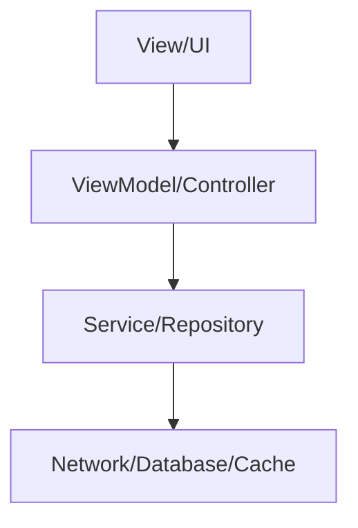
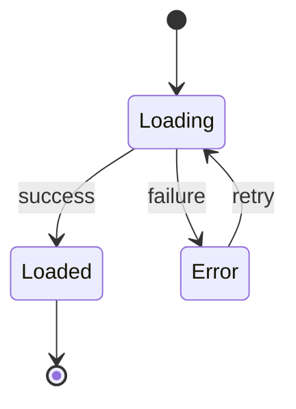
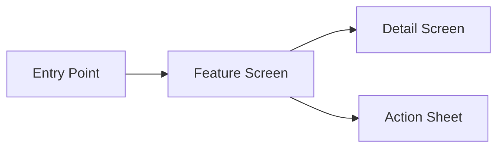

## GitHub Integration

The GitHub project URL is stored per-project in `.claude/github-project-url` in the workspace root. On first use the agent writes it; on subsequent runs it reads it silently. See Step 10.

# Story to Spec

Generate a complete, implementation-ready spec from a story, acceptance criteria, or task description. Output is a Markdown file in `.claude/specs/`.

**IMPORTANT: Ask only ONE question at a time. Wait for the user's response before asking the next question. Never batch multiple questions into a single message.**

## Process

### 1. Confirm the story is in context

The story, acceptance criteria, or task description should already be in the conversation. If it isn't, ask the user to paste it or point you to the file/ticket.

### 2. Gather context from specs and codebase

**Check for existing requirements and specs first:**
- Read `.claude/specs/` for existing feature specs, requirements, and acceptance criteria related to this story
- Check `.claude/steering/` for project conventions and architectural guidance
- Look for any PRDs, design docs, or spec files in the current repo that relate to the story

**Then explore the codebase to understand:**
- Current architecture and patterns relevant to this story
- Existing code that will be touched or extended
- Related features already implemented
- Available shared components and abstractions
- Existing test coverage in the area — check for test targets, test patterns, and mocks already in use

Use `web_fetch` to pull content from URLs (issues, wikis, docs) or any external documentation that would help ground the spec. Use `web_search` to find relevant technical documentation, patterns, or prior art when the story involves unfamiliar APIs or third-party integrations.

Summarize what you found from existing specs — call out any conflicts between the story and existing requirements.

### 3. Consult available agents

Based on what the story touches, consult the relevant agents:

| Domain | Agent | When to consult |
|--------|-------|-----------------|
| Architecture, patterns, module boundaries | `@architect` | Always — for structural feasibility and pattern guidance |
| Stress-testing the design, decision-tree exploration | `@grill-me-planner` | When the design has complex trade-offs or the user wants to pressure-test the approach |
| PRD breakdown, tracer-bullet vertical slices, parallelization | `@feature-decomposer` | When the story originates from a PRD or epic and needs phased implementation planning |
| Refactoring strategy, incremental safe steps | `@request-refactor-plan` | When the story requires refactoring existing code as part of the implementation |

Summarize what you learned from each consultation. These findings feed directly into the spec.

### 4. Clarify ambiguities with the user

Interview the user ONE question at a time to resolve:
- Unclear acceptance criteria or edge cases
- Scope boundaries (what's in, what's out)
- UX behavior not covered by the story (error states, empty states, loading)
- Platform considerations
- Any conflicts between the story and what you found in the codebase

**Scope creep guardrail**: If the user's answers expand scope beyond the original story, call it out explicitly: *"That sounds like it could be a separate story. Want to keep it in scope here, or split it out?"* Bias toward splitting — smaller stories ship faster and safer.

**When the user says "I don't know"**: Don't stall. Offer a recommended answer based on what you found in the codebase: *"Based on how [similar feature] works in the codebase, I'd recommend [X]. Want to go with that?"*

Stop interviewing once all ambiguities are resolved. Don't over-interview for simple stories.

### 5. Present the approach

Before writing the spec, present:
- A brief summary of the proposed design approach
- Key architectural decisions
- Which existing components/abstractions will be reused
- Any risks or open questions

Wait for user approval before proceeding.

### 6. Write the spec

Create `.claude/specs/` if it doesn't exist. Write the spec as a Markdown file named after the feature (e.g., `.claude/specs/weather-detail-redesign.md`). Use the template below.

### 7. Review and iterate

After writing the spec, present a summary to the user and explicitly ask:

> "The spec is written to `.claude/specs/<name>.md`. Before we generate the execution docs, please review it. What would you like to change, add, or remove?"

Iterate until the user approves. The spec status stays `Draft` until approved, then update to `Approved`.

### 8. Generate execution documents

Once the spec is approved, generate three separate files that a developer can use to execute the work. These files reference the spec as the source of truth.

**File 1: `.claude/specs/<name>/requirements.md`**
Extract from the approved spec:
- Source Documents table
- Functional Requirements table
- Non-Functional Requirements table
- Use Case Matrix
- Analytics Events (if applicable)
- Dependencies & Prerequisites

**File 2: `.claude/specs/<name>/design.md`**
Extract from the approved spec:
- All Mermaid diagrams (data flow, state machine, navigation flow)
- Key Design Decisions
- Agent Consultation Summary
- Regression Safety (release strategy recommendation + rollback plan)
- Link back to requirements: `See [requirements.md](./requirements.md) for full acceptance criteria.`

**File 3: `.claude/specs/<name>/tasks.md`**
Extract from the approved spec:
- The full task list with start-here hints, tests, manual verification, and LOE per task
- Total estimated LOE
- Testing plan (automated + manual test cases)
- Link back to design and requirements: `See [design.md](./design.md) and [requirements.md](./requirements.md) for context.`

Each task in `tasks.md` should be self-contained enough that a developer (or `@implementer`) can pick it up and execute it with everything needed: what to build, where to start, what to test, and how to verify.

### 9. Generate handoff summary

After generating the execution docs, create a fourth file: `.claude/specs/<name>/handoff.md`

This is a concise, human-readable summary designed for a 2-minute read. It should answer:

1. **What are we building?** — One paragraph, plain language. State what changes and what doesn't change.
2. **Why?** — Business context. Why does this matter?
3. **How does it work?** — Numbered steps of the runtime flow, written like you're explaining it at a whiteboard. No code, no file paths.
4. **Key decisions to know about** — Table of design decisions and their rationale. Only include decisions where the "why" isn't obvious.
5. **Task order** — Simple table: task number, what it does, what it depends on.
6. **Where to start** — Point to `tasks.md` and any other relevant files.

**Guidelines:**
- Keep it under 40 lines.
- No Mermaid diagrams, no requirement IDs, no acceptance criteria tables — that's what the other docs are for.
- Write it in the voice of a tech lead briefing a teammate, not a spec document.
- Assume the reader is a competent developer who just needs context, not hand-holding.

After generating all four files, confirm with the user:

> "Execution docs generated:
> - `.claude/specs/<name>/requirements.md`
> - `.claude/specs/<name>/design.md`
> - `.claude/specs/<name>/tasks.md`
> - `.claude/specs/<name>/handoff.md` ← paste this in the MR/PR description when assigning
>
> You can now work through the tasks by running `@implementer` or implementing them one at a time."

Then immediately proceed to Step 10.

---

### 10. Create GitHub issue (if applicable)

Ask: *"Would you like me to create a GitHub issue for this story and add it to your project backlog?"*

If yes:

**10a. Resolve the GitHub project URL**

Check for `.claude/github-project-url` in the workspace root:

```bash
cat .claude/github-project-url 2>/dev/null
```

If the file exists, use that URL. If it does not exist, ask:
*"What's the URL of your GitHub project board? (e.g. `https://github.com/users/you/projects/1`)"*

Then save it:
```bash
mkdir -p .claude && echo "<url>" > .claude/github-project-url
```

Parse `owner` and `project number` from the URL:
- `https://github.com/users/<owner>/projects/<N>` → owner type: user
- `https://github.com/orgs/<owner>/projects/<N>` → owner type: org

**10b. Identify the target repo**

Ask: *"Which GitHub repo should I create the issue in? (e.g. `owner/repo`)"*

**10c. Check for a parent issue**

Ask: *"Is this story part of a larger feature tracked in GitHub? If so, paste the parent issue URL or number and I'll link to it."*

If the user provides one, include it in the issue body. If not, skip.

**10d. Create the issue**

```bash
gh issue create \
  --repo <owner>/<repo> \
  --title "<Story title>" \
  --body "<body>" \
  --label "backlog"
```

Issue body format:
```markdown
## Summary
<One paragraph plain-language description of what this story delivers — from handoff.md>

## Acceptance Criteria
<Paste the functional requirements table or bullet list from the spec>

## LOE
<Total estimated LOE from tasks.md>

## Spec
- [Handoff](.claude/specs/<name>/handoff.md)
- [Requirements](.claude/specs/<name>/requirements.md)
- [Design](.claude/specs/<name>/design.md)
- [Tasks](.claude/specs/<name>/tasks.md)

## Dependencies
<"None" or "Part of #N" if a parent issue was provided>

---
*Generated by story-to-spec*
```

**10e. Add the issue to the project board**

```bash
gh project item-add <project-number> --owner <owner> --url <issue-url>
```

**10f. Confirm**

> "Issue created: <issue-url>
> Added to project board: <project-url>"

If the user declined in 10c, skip the parent link silently — don't ask again.

**If the user declines GitHub issue creation**, skip this step entirely.

<spec-template>
# Spec: <Feature Name>

> Source: <story/ticket identifier or brief description>
> Date: <date>
> Status: Draft

## Source Documents

| Document | Location | Relevance |
|----------|----------|-----------|
| ... | `.claude/specs/...` | ... |

<!-- List the existing specs, requirements, PRDs, and design docs that informed this spec. Omit if none found. -->

---

## 1. Requirements

### Functional Requirements

| ID | Requirement | Acceptance Criteria | Priority |
|----|-------------|---------------------|----------|
| FR-1 | ... | ... | Must |
| FR-2 | ... | ... | Must |
| FR-3 | ... | ... | Should |

### Non-Functional Requirements

| ID | Requirement | Criteria |
|----|-------------|----------|
| NFR-1 | Accessibility | Keyboard navigable, screen reader support, sufficient color contrast |
| NFR-2 | Performance | ... |
| NFR-3 | Error handling | ... |

---

## 2. Design

### Data Flow



<!-- Adapt the diagram to the actual feature. Show the real components and data flow. -->

### State Machine



<!-- Include a state diagram if the feature has meaningful state transitions. Omit if trivial. -->

### Navigation Flow



<!-- Include if the feature involves navigation. Omit if single-screen. -->

### Key Design Decisions

- **Decision 1**: <what and why>
- **Decision 2**: <what and why>

### Agent Consultation Summary

| Agent | Findings |
|-------|----------|
| @architect | ... |
| ... | ... |

---

## 3. Use Case Matrix

| Use Case | Precondition | Action | Expected Result | Error Handling |
|----------|-------------|--------|-----------------|----------------|
| Happy path | ... | ... | ... | — |
| Empty state | No data available | ... | Show empty view | — |
| Network error | No connectivity | ... | Show error with retry | Retry button |
| Auth expired | Token invalid | ... | Redirect to login | — |
| ... | ... | ... | ... | ... |

---

## 4. Dependencies & Prerequisites

| Dependency | Owner/Team | Status | Blocker? |
|------------|-----------|--------|----------|
| ... | ... | ... | Yes/No |

<!-- Surface external dependencies early. If none, state "No external dependencies." -->

---

## 5. Regression Safety

### Release Strategy Recommendation

**Option A: Feature Flag** (Recommended for most features)
- Flag name: `<featureName>Enabled` (default: `false`)
- Toggle point: <where in the architecture the flag is checked>
- Lower risk: instant rollback, supports gradual rollout

**Option B: Feature Branching**
- Higher risk: merge conflicts accumulate, integration issues surface late
- Use when: the change is purely additive with zero overlap with ongoing work

### Rollback Plan

- <What happens if the feature is turned off mid-rollout>

---

## 6. Testing Plan

### Automated Tests

| Component | Test Type | What to Verify | Prior Art |
|-----------|-----------|----------------|-----------|
| ViewModel/Controller | Unit | State transitions, error mapping, edge cases | <similar test class in codebase> |
| Service/Repository | Unit | Data mapping, caching logic, error handling | ... |
| ... | Integration | ... | ... |

<!-- Identify testable components from the design. Reference existing test patterns in the codebase. -->

### Manual Test Cases

| ID | Scenario | Steps | Expected Result |
|----|----------|-------|-----------------|
| MT-1 | ... | 1. ... 2. ... | ... |
| MT-2 | ... | 1. ... 2. ... | ... |

---

## 7. Task List

Ordered implementation tasks as vertical slices. Each task should be independently mergeable and leave the codebase in a working state.

- [ ] **Task 1: <title>** — <what to build/change>
  - Start here: <files/areas to look at>
  - Tests: <unit/integration tests for this slice>
  - Manual verification: <manual test cases to run>
  - LOE: <estimated effort — e.g., 0.5d, 1d, 2d>
- [ ] **Task 2: <title>** — <what to build/change>
  - Start here: <files/areas to look at>
  - Tests: <unit/integration tests for this slice>
  - Manual verification: <manual test cases to run>
  - LOE: <estimated effort>
- [ ] ...

**Total estimated LOE**: <sum of all tasks>

---

## 8. Out of Scope

- <what is explicitly not included in this spec>

## 9. Open Questions (if any)

- <unresolved questions that need input>

</spec-template>

### Template guidelines

- Every section should reflect what you actually found in the codebase — not generic boilerplate.
- Mermaid diagrams should use real component names and types from the codebase.
- The use case matrix should cover edge cases surfaced during codebase exploration.
- The task list should be ordered for incremental delivery — each task is a vertical slice, not a horizontal layer. Every task must include its associated tests, manual verification, and LOE estimate.
- The testing plan should reference existing test patterns in the codebase (prior art). Test external behavior, not implementation details.
- LOE estimates should account for implementation, tests, code review, and manual verification. Use day units (0.5d, 1d, 2d, etc.).
- Omit optional sections (state machine, navigation flow, open questions) if they don't apply. Don't pad the spec.
- The three execution docs (requirements, design, tasks) must be consistent with the approved spec.
